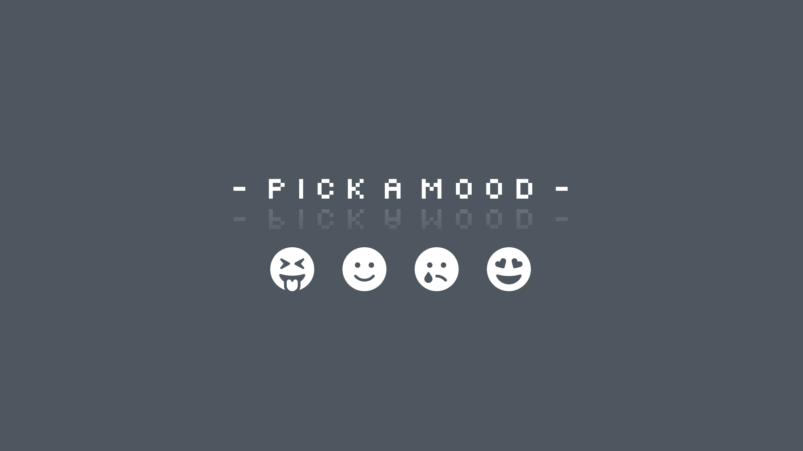
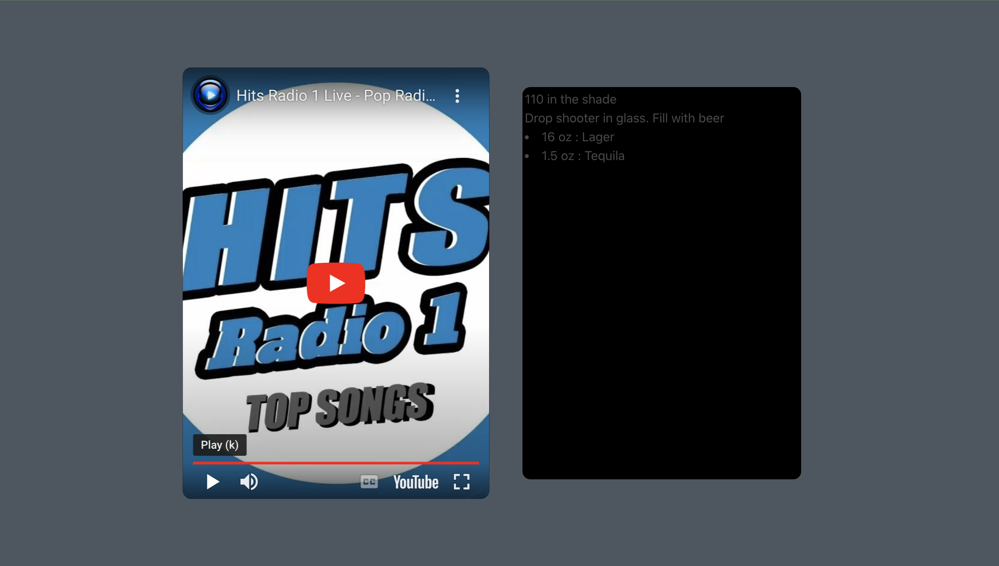

# Moodist Media App

## About The Project

*Deployed Website*
https://jstaples50.github.io/Project-1/

The Moodist app creates a youtube song selection and cocktail recipe based on your mood. The user selects an emotion icon and is taken to a presentation page that shows a playable youtube song and cocktail recipe. 

## Built With

- Bulma
- HTML/CSS 
- JavaScript
- YouTube data API
- YouTube iFrame player API
- TheCocktailBD API

## Usage

Navigate to the deployed website and select the emojicon representing your current mood. You will be taken to a presentation page that offers a cocktail recipe and youtube video to provide ambiance.

## Notes on Development 

This project presented several new obstacles to navigate. Some issues that were overcome and led to new skill sets include:

- Making multiple API calls in the correct order and parsing the data efficiently 
- Using the Bulma CSS framework to create a pleasing UX 
- Navigating copyright issues when making youtube API calls
- Finding the correct search parameters in the Cocktail DB to match the written code to render the  data in the Moodist application
- Integrating code sources from multiple devlopers into one file structure
- Using github and version control effectively 

## For Future Development

In the future, the development team would like to: 

- Use the Spotify API to create random playlist for the user depending on mood choice
- Create a larger selection of drink recipes available depending on mood choice

## Credits

This application was developed by Solo Huckstep, Michael Etoama, and Jared Staples